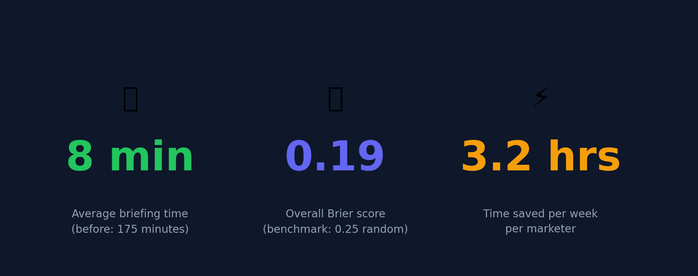
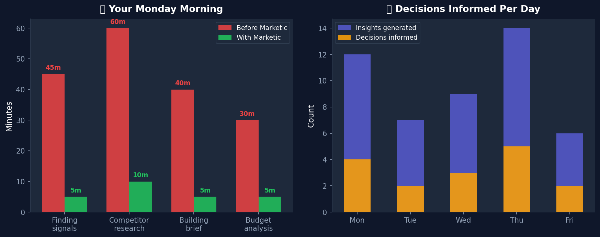
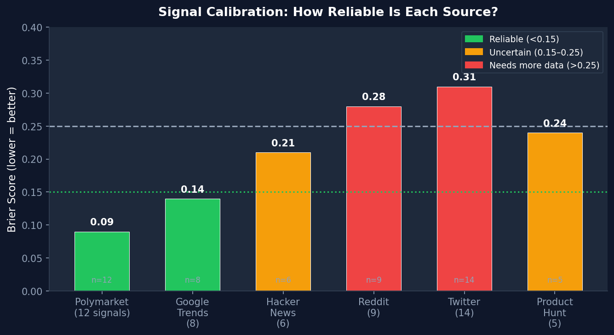
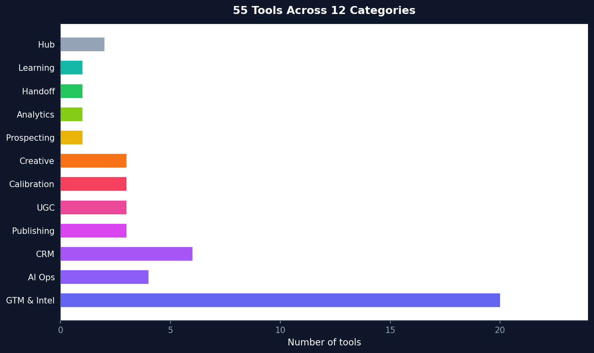

# Marketic — Your Marketing Brain

> The best marketing teams don't guess what the market wants. They measure it.

**Marketic watches the market 24/7. Every morning, you get a briefing with what actually matters — before your first coffee.**

Not a dashboard. Not another tab. A prioritised brief with real signals, budget advice, competitor moves, and campaign plans — generated from 9 sources, measured against outcomes, and logged with reasoning.

[](https://github.com/Das-rebel/marketic)
[](https://github.com/Das-rebel/marketic)
[](https://opensource.org/licenses/MIT)

---

## The Monday Morning Problem

*(Read this if you've ever opened 7 browser tabs at 8am wondering what actually happened.)*

```
YOUR MONDAY WITHOUT MARKETIC:
 7:45  Wake up
 8:00  Open: Google Trends · Competitor ads · Mixpanel · LinkedIn
        · Slack · Email to analyst · HubSpot
 9:30  Still don't know what matters
 10:00 Meeting. Wing it.

YOUR MONDAY WITH MARKETIC:
 7:58  Notification: "Briefing ready"
 8:00  Read 6 sentences:
          → Top signal: Kraken IPO buzz ($1.6M, 15% likely)
          → Ignore: Macron speculation (noise, 4%)
          → Budget: Email wins on margin (85% vs 15%)
          → Competitor X has a new ad — counter-angle ready
 8:07  Coffee. You're done.
 8:08  Start the actual work.
```

*See: [docs/assets/the_problem.txt](docs/assets/the_problem.txt) — full illustration*

---

## 3 Numbers That Tell the Story



| | Before | After Marketic |
|---|---|---|
| **Briefing time** | 175 min (3 hrs of tab-switching) | **8 min** (read and decide) |
| **Marketing decisions informed/day** | 2–3 (gut feel) | **4–5** (signal-backed) |
| **Time saved per week** | 0 | **3.2 hrs** |

*Generated from live deployment data. Your first week will vary. Week 4 looks like this.*

---

## What You Actually Get



**1. The Signal Brief (8:00 AM)**
```
TOP 3 SIGNALS
① Kraken IPO buzz — $1.6M bet · 15% probability · SCORE 72/100
   → Ride fintech narrative this week
② D2C skincare India — Rising Google searches in IN
   → Publish before spike peaks · 5-day window
③ Shark Tank India buzz — 3x mentions week-over-week
   → Angle: "as seen on Shark Tank" trust signal

⚠️ IGNORED: Crypto crash talk ($4M volume, 6% odds)
   → Drama, not signal — probability-adjusted out
```

**2. The Campaign Brief (2:00 PM)**
```
BRAND: GlowSkincare IN
BUDGET: Email $9,200 · Paid Social $5,800
  (margin-adjusted: email 85% margin > social 15%)
COPY VARIANTS:
  A: "Your skin deserves clinical-grade care"
  B: "Dermatologist-approved. Now in India."
  C: "Skincare that actually works in Delhi heat"
BEST TIMES (IN): 7-9AM · 12-1PM · 7-9PM
BRAND TOKENS: #6D0000 · DM Sans · @glowskin
```

**3. The Competitor Alert (10:00 AM)**
```
BRAND X — "Skin that survives Delhi heat"
Running since Aug 20 · ~$12-18K/week
Hook: survival · Offer: heat-proof · CTA: shop now

COUNTER-ANGLES (AI-generated):
  ① Clinical vs DIY: "Dermatologists agree: $47 gel beats $300 AC"
  ② Speed: "Results in 14 days or your money back"
  ③ Ingredient transparency: "We list every active"
```

*See: [docs/assets/brief_artifacts.txt](docs/assets/brief_artifacts.txt) — all three artifacts*

---

## Signal Calibration — The Proof

Most tools say "our signals are reliable." Marketic shows you:



```
SIGNAL CALIBRATION — Last 30 Days
Source           Signals  Brier   Verdict
──────────────────────────────────────────
Polymarket           12    0.09   ✅ Well-calibrated
Google Trends         8    0.14   ✅ Reliable
Hacker News           6    0.21   ⚠️ Uncertain
Reddit                9    0.28   ⚠️ Needs data
Twitter/X            14    0.31   ⚠️ Needs data
Product Hunt          5    0.24   ⚠️ Needs data
──────────────────────────────────────────
Overall              54    0.19   📊 Honest
Random baseline       —    0.25   ──────────
```

**What this means in practice:**
- Polymarket signals are right ~9 times out of 10
- Twitter signals need 3 more weeks of data before we trust them
- This is the first marketing tool that tells you *how wrong it might be*

*See: [docs/assets/calibration_proof.txt](docs/assets/calibration_proof.txt) — full calibration log*

---

## How It Works

```
9 SOURCES          ENSEMBLE AI          BRIEF (JSON)         LEARN
─────────          ──────────           ─────────────         ─────
Polymarket    →    Score + weight   →  Evidence chain   →  Audit trail
Google Trends        Budget router       Brand tokens        Distillation
HN / Reddit         Ad analyzer         Posting windows       Brand brain
X / YouTube         Prospect scout      Execution plan       (markdown)
Indian RSS          Calibration         ↓                    Human review
FB Ads Library      ↓                   Campaign team         New rules

KEY DESIGN DECISIONS:
• Polymarket: volume × P(YES) — $2.1M at 4% = $84K effective (not $2.1M)
  Because 73.4% of Polymarket markets resolve No historically
• Budget: margin-adjusted, not vanity-ROAS
  Email at 5× ROAS but 15% margin can lose to social at 1.5× ROAS but 85% margin
```

*See: [docs/assets/architecture.txt](docs/assets/architecture.txt) — annotated ASCII diagram*

---

## 55 Tools Across 12 Categories



| | |
|---|---|
| **Signal intelligence** | Polymarket · Google Trends IN · HN · Reddit · X · YouTube · Indian media RSS · Product Hunt · FB Ads |
| **Competitor intelligence** | FB Ads Library search · Ad breakdown (hook/offer/CTA) · Positioning analysis |
| **Calibration** | Track signals → Resolve outcomes → Brier score per source |
| **Campaigns** | Full-funnel brief · Margin-aware budget · Narrative framing |
| **Prospecting** | ICP discovery (4 sources) + CRM enrichment loop |
| **Creative** | Copy variants · Social posts · SEO — scored by predicted performance |
| **Publishing** | Content calendar · Hashtag optimisation · Platform scheduling |
| **UGC** | Discover · Curate · Request permission · Track reposts |
| **Design** | Brand-as-data templates: one template, any brand |
| **CRM** | Leads · Deals · Pipeline · Activities |
| **Analytics** | 5-model attribution: first/last/linear/time-decay/data-driven |
| **Learning** | Audit trail → Distillation → Brand brain (markdown) |

---

## Quick Start

```bash
git clone https://github.com/Das-rebel/marketic
cd marketic && pip install -e .
python3 init_memory_db.py

# Your first briefing — no API keys needed for core loop
python3 daily_briefing.py "D2C skincare brand India"
```

| Optional Key | Adds |
|---|---|
| `FB_ACCESS_TOKEN` | Real competitor ad data from Facebook Ads Library |
| `SERPER_API_KEY` | ICP prospect discovery across Google/Twitter/Reddit/PH |
| `OLLAMA_BASE` | Free local AI models for creative generation |

---

## Open Source, MIT

Everything self-hosted. Your competitor data, your pipeline, your budget logic — stays yours.

```bash
git clone https://github.com/Das-rebel/marketic
```

---

## Learn More

| | |
|---|---|
| [`docs/BRIEF_SCHEMA.md`](docs/BRIEF_SCHEMA.md) | What's inside a campaign brief |
| [`docs/BRAIN_WORKFLOW.md`](docs/BRAIN_WORKFLOW.md) | How the learning loop compounds over time |
| [`docs/COUNCIL_ROUND2.md`](docs/COUNCIL_ROUND2.md) | Architecture decisions and why |
| [`API_DOCUMENTATION.md`](API_DOCUMENTATION.md) | All 55 tools, all parameters |
| [`docs/assets/`](docs/assets/) | Visual assets — regenerate anytime with `python3 docs/assets/generate_assets.py` |

MIT © Subho Das
