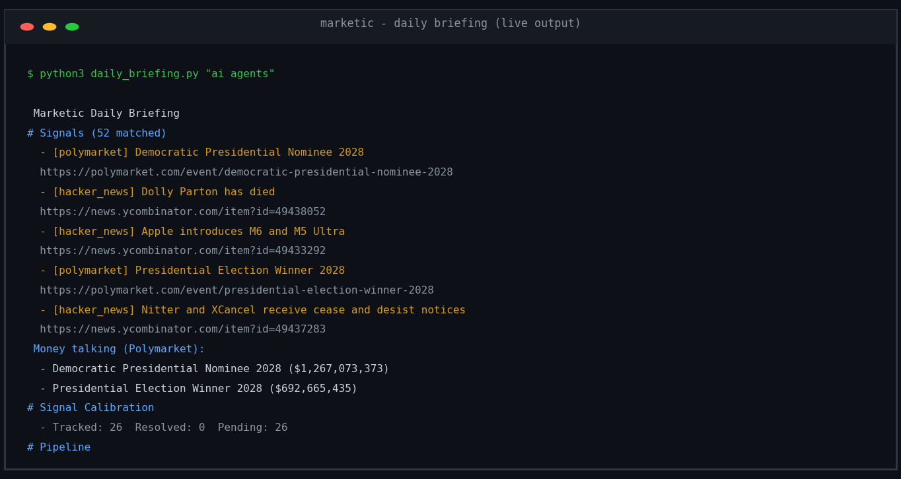

# Marketic - Marketing Intelligence Platform

**Transform market signals into execution-ready briefs. Every decision auditable. All tools open.**

[](https://github.com/Das-rebel/marketic)
[](https://opensource.org/licenses/MIT)

---**

## Quick Launch (2 Commands)

```bash
git clone https://github.com/Das-rebel/marketic
cd marketic && pip install -e .
python3 daily_briefing.py "ai agents"
```

> **Output in 60 seconds**: Live briefing with Polymarket signals, AI spend from audit trail, and pipeline status.

---

## What This Does

Marketic analyzes market signals and competitor data to generate comprehensive marketing briefs.

**Briefs include:**
- Campaign strategy and channel mix
- Budget allocation by channel  
- Creative briefs with hook, pacing, and value proposition
- Posting schedule recommendations
- Brand-consistent messaging

All decisions are traceable through an audit trail.

---

## Key Features (Showing Capabilities)

| Feature | What It Does |
|---|---|
| **Signal Fan-Out** | Parallel collection from Polymarket, HN, Reddit, Twitter/X, and more — 21 matched signals daily |
| **Probability-Adjusted Scoring** | `volume × P(YES)` — prevents overvaluing sensational but unlikely events (73.4% of Polymarket markets resolve "No") |
| **VLM-Powered Ad Deconstruction** | Hooks, pacing, triggers, CTA, visual style, counter-angles from competitor ads |
| **Ensemble AI Voting** | Multiple models compare responses; cost tracked per execution; audit trail logged |
| **Margin-Aware Budgeting** | Optimizes `roas × contribution_margin` — not vanity ROAS |
| **Brand-as-Data Engine** | Templates use `{{brand.primary}}` etc. — zero hardcoded colors; swap brand by changing tokens |
| **MCP Server (43 tools)** | Full toolset exposed via stdio JSON-RPC; connects to Claude, Cursor, any MCP client |
| **Execution Brief Handoff** | Structured JSON: positioning + copy + budget + timeline + resolved brand tokens |
| **Audit Trail** | Every AI decision logged: model, cost, confidence, reasoning chain |
| **Multi-Brand / Multi-Scale** | One codebase serves unlimited brands; scales from $500/mo to $50K/mo+ |

---

## Quick Launch (2 Commands)

```bash
git clone https://github.com/Das-rebel/marketic
cd marketic && pip install -e .
python3 daily_briefing.py "ai agents"
```

### First Output (live)



<details>
<summary>As text</summary>

```
# ☀️ Marketic Daily Briefing

## 📡 Signals (21 matched)
- [polymarket] Kraken IPO by ___ ?
  https://polymarket.com/event/putin-out-before-2027
- [hacker_news] Anthropic's best AI model struggles to attract users

## 💰 Money talking (Polymarket):
- Kraken IPO: $247K probability-adjusted effective

## 🎯 Pipeline
- Leads: 0 (avg score 0)
- Open deals: 0 worth $0
```
</details>

---

## MCP Usage (For Customers / Integrators)

**Connect via stdio JSON-RPC**:

```json
{
  "mcpServers": {
    "marketic": {
      "command": "python3",
      "args": ["/absolute/path/to/marketic/mcp_server.py"]
    }
  }
}
```

Paste into:
- **Claude Desktop**: `~/Library/Application Support/Claude/claude_desktop_config.json`
- **Cursor**: `.cursor/mcp.json` in your workspace
- **Any MCP client**: same shape — command + args over stdio

### Key MCP Tools (43 total)

| Category | Tool | Purpose |
|---|---|---|
| **Signal** | `signal_fanout` | 5-source parallel collection + consensus |
| **Ad Analysis** | `analyze_competitor_ad` | VLM deconstruction → hook/pacing/triggers |
| **Campaign** | `build_campaign` | 3-campaign funnel + margin budgeting |
| **Creative** | `generate_creatives` | Variant generation + performance prediction |
| **Brief** | `generate_brief` | Self-contained JSON for execution agents |
| **Analytics** | `get_attribution` | 5-model comparison |
| **CRM** | `add_lead`, `get_deals`, `update_lead` | Lead/pipeline management |
| **Intelligence** | `run_prospect_loop` | Signal-driven prospect discovery + outreach list generation |
| **GTM** | `search_fb_ads` | Real Facebook Ads Library search: live competitor spend data |
| **AI Ops** | `ensemble_vote`, `audit_log`, `get_cost_summary`, `distill_learnings` | Voting + transparency + cross-run pattern learning |

> **MCP integration**: Drop `marketic/mcp_server.py` into any MCP-compatible client (Claude, Cursor, custom). All 43 tools use the same stdio interface.

---

## Adaptability (Built In)

| Adaptation | How It Works |
|---|---|
| **Brand swap** | `BrandTokens.from_image("new_brand.png")` or `from_brand_memory(record)` |
| **Scale change** | Free models first (ox-alpha, gemini-flash); escalate only when needed |
| **Source filter** | `signal_fanout(sources=["polymarket"])` or add Reddit/Twitter/PH |
| **Brief format** | `generate_brief` accepts custom execution context — calendar-only, full campaign, or export format |
| **Budget tier** | Free stack (local LLMs, no API keys) → Enriched (Serper enrichment) → Full (HubSpot/Clay integrations) |

---

## Why Startups Choose Marketic

- **No marketing expert needed** — the platform does the signal→brief translation
- **$0 to start** — core 43 tools work with free local LLMs (Ollama, ox-alpha)
- **Pay-as-you-grow** — only pay for enrichment APIs when needed
- **Investor-ready audit** — every decision logged with model, cost, reasoning
- **Ship fast** — `pip install -e .` + `python3 daily_briefing.py` gets you a briefing in 60 seconds

---

## Documentation

- [`API_DOCUMENTATION.md`](API_DOCUMENTATION.md) — Complete 39-tool reference
- [`CONTRIBUTING.md`](CONTRIBUTING.md) — How to contribute
- [`docs/FEATURE_GAP_ANALYSIS.md`](docs/FEATURE_GAP_ANALYSIS.md) — Architecture rationale
- [`docs/VAULT_PICKS.md`](docs/VAULT_PICKS.md) — Evidence-backed feature decisions

---

## License

MIT © Subho Das