# Marketic — Your Marketing Brain

> The best marketing teams don't guess what the market wants. They measure it.

**Marketic watches the market 24/7. Every morning, you get a briefing with what actually matters — before your first coffee.**

Not a dashboard. Not another tab. A prioritised brief with real signals, budget advice, competitor moves, and campaign plans — generated from 9 sources, measured against outcomes, and logged with reasoning.

[](https://github.com/Das-rebel/marketic)
[](https://github.com/Das-rebel/marketic)
[](https://opensource.org/licenses/MIT)

---

## The Monday Morning Problem

*(If you've ever opened 7 browser tabs at 8am wondering what actually happened — this is for you.)*

```text
YOUR MONDAY WITHOUT MARKETIC
━━━━━━━━━━━━━━━━━━━━━━━━━━━━━━━━━━━━━━━━━━━━━━━━━━━━━━
  7:45  Wake up. Coffee. Open laptop.
  8:00  Open 7 browser tabs:
           Google Trends  "what's trending?"
           Competitor ads "what launched?"
           Mixpanel      "why did last week drop?"
           LinkedIn      "what's everyone saying?"
           Slack #mktg  "did anyone reply?"
           Email analyst "can you pull..."
           HubSpot      "which lead converted?"
  9:30  Still don't know what matters.
  10:00 Stand-up. Wing it.

YOUR MONDAY WITH MARKETIC
━━━━━━━━━━━━━━━━━━━━━━━━━━━━━━━━━━━━━━━━━━━━━━━━━━━━━━
  7:58  Notification: "Your briefing is ready"
  8:00  Read 6 sentences:
           ① Kraken IPO buzz ($1.6M, 15% likely)
              → Ride fintech content today
           ② D2C skincare India rising (Google IN)
              → Publish before the spike peaks
           ③ Shark Tank India: 3x mentions this week
              → "As seen on Shark Tank" angle
           ⚠ IGNORED: Crypto drama ($4M, 6% likely)
              → Probability-adjusted — doesn't make the brief
           📊 Budget: Email $9,200 · Social $5,800
              → Email margin 85% > Social 15%
           🤖 Competitor X: new ad live since Tue
              → Counter-angle: clinical vs DIY
  8:07  Coffee. Done.
  8:08  Start the actual work.
```

*See: [docs/assets/monday_problem.txt](docs/assets/monday_problem.txt)*

---

## 3 Numbers That Tell the Story

| | Before | With Marketic |
|---|---|---|
| **Briefing time** | 175 min | **8 min** |
| **Decisions informed/day** | 2–3 (gut feel) | **4–5** (signal-backed) |
| **Time saved per week** | 0 | **3.2 hrs** |

*See: [docs/assets/comparison_table.txt](docs/assets/comparison_table.txt)*

---

## What You Actually Get

**1. The Signal Brief (8:00 AM)**

```
TOP SIGNALS
① Kraken IPO buzz — $1.6M bet · 15% probability · SCORE 72/100
   → Ride fintech narrative this week
② D2C skincare India — Rising Google searches in IN
   → Publish before spike peaks · 5-day window
③ Shark Tank India buzz — 3x mentions week-over-week
   → Angle: "as seen on Shark Tank" trust signal

⚠ IGNORED: Crypto crash talk ($4M volume, 6% odds)
   → Drama, not signal — probability-adjusted out
```

**2. The Campaign Brief (2:00 PM)**

```
BRAND: GlowSkincare IN
BUDGET: Email $9,200 · Paid Social $5,800
  (margin-adjusted: email 85% margin > social 15%)

COPY VARIANTS:
  A: "Your skin deserves clinical-grade care"
  B: "Dermatologist-approved. Now in India."
  C: "Skincare that actually works in Delhi heat"

BEST TIMES (IN): 7-9AM · 12-1PM · 7-9PM
BRAND TOKENS: #6D0000 · DM Sans · @glowskinofficial
```

**3. The Competitor Alert (10:00 AM)**

```
BRAND X — "Skin that survives Delhi heat"
Running since Aug 20 · ~$12-18K/week
Hook: survival · Offer: heat-proof · CTA: shop now

COUNTER-ANGLES (AI-generated):
  ① Clinical vs DIY: "Derms agree: $47 gel > $300 AC"
  ② Speed: "Results in 14 days or money back"
  ③ Transparency: "We list every active ingredient"
```

*See: [docs/assets/sample_brief.txt](docs/assets/sample_brief.txt)*

---

## Signal Calibration — The Proof

Most tools say "our signals are reliable." Marketic shows you:

```text
SIGNAL CALIBRATION — Last 30 Days
════════════════════════════════════════════════════
 Source            Signals   Brier   Verdict
────────────────────────────────────────────────────
 Polymarket              12    0.09   ✅  Well-calibrated
 Google Trends            8    0.14   ✅  Reliable
 Hacker News              6    0.21   ⚠️  Uncertain
 Reddit                   9    0.28   ⚠️  Needs data
 Twitter / X             14    0.31   ⚠️  Needs data
 Product Hunt             5    0.24   ⚠️  Needs data
────────────────────────────────────────────────────
 Overall                54    0.19   📊  Honest
 Random baseline         —    0.25   ─────  ─────
════════════════════════════════════════════════════

Brier score:  0.00 = perfect  ·  0.25 = random  ·  Higher = worse
```

**What this means:**
- Polymarket signals: right ~9 out of 10 times
- Twitter/X signals: 3 more weeks of data before we trust them
- This is the first marketing tool that tells you *how wrong it might be*

*See: [docs/assets/calibration_table.txt](docs/assets/calibration_table.txt)*
*See: [docs/assets/calibration.mmd](docs/assets/calibration.mmd) — pie chart*

---

## How It Works

```mermaid
flowchart LR
    subgraph SENSE["📡 SENSE"]
        P[Polymarket]
        G[Google Trends]
        H[Hacker News]
        R[Reddit]
        X[X / Twitter]
        Y[YouTube]
        I[Indian RSS]
        F[FB Ads Library]
    end

    subgraph THINK["🧠 THINK"]
        EA[Ensemble AI]
        SC[Scorecard]
        BR[Budget Router]
        AA[Ad Analyzer]
        PS[Prospect Scout]
    end

    subgraph HANDOFF["📋 HANDOFF"]
        BF[Brief JSON]
        BT[Brand Tokens]
        PW[Posting Windows]
    end

    subgraph LEARN["🔄 LEARN"]
        AT[Audit Trail]
        DS[Distillation]
        BB[Brand Brain]
    end

    SENSE -->|"volume × P(YES)"| THINK
    SENSE -->|"all signals"| SC
    THINK -->|"scored signals"| EA
    EA -->|"reasoned"| BR
    EA -->|"ad insights"| AA
    EA -->|"prospects"| PS
    BR -->|"budget split"| BF
    AA -->|"counter-angles"| BF
    PS -->|"enriched leads"| BF
    BF -->|"handoff"| HANDOFF
    BT --> HANDOFF
    PW --> HANDOFF
    HANDOFF -->|"execute"| AT
    AT -->|"patterns"| DS
    DS -->|"approved rules"| BB
    BB -->|"inject"| THINK

    classDef sense fill:#6366f1,color:#fff,stroke:none
    classDef think fill:#f59e0b,color:#fff,stroke:none
    classDef handoff fill:#22c55e,color:#fff,stroke:none
    classDef learn fill:#f43f5e,color:#fff,stroke:none
    class P,G,H,R,X,Y,I,F sense
    class EA,SC,BR,AA,PS think
    class BF,BT,PW handoff
    class AT,DS,BB learn
```



*See: [docs/assets/architecture.mmd](docs/assets/architecture.mmd)*

**Two design decisions worth knowing:**

1. **Polymarket: volume × P(YES)** — $2.1M at 4% = $84K effective, not $2.1M. Because 73.4% of all Polymarket markets resolve "No" historically. Raw volume overweights drama.

2. **Budget: margin-adjusted, not vanity-ROAS** — Email at 5× ROAS but 15% margin can lose to social at 1.5× ROAS but 85% margin. Marketic recommends where profit actually lands.

---

## 55 Tools Across 12 Categories

```mermaid
flowchart TB
    subgraph GTM["🎯 GTM & Intel (20 tools)"]
        A1[search_fb_ads]  A2[analyze_competitor_ad]
        A3[analyze_competitor]  A4[analyze_positioning]
        A5[breakdown_ad]  A6[generate_narrative]
        A7[discover_prospects]  A8[signal_fanout]
        A9[...]
    end

    subgraph CORE["⚙️ Core (12 tools)"]
        B1[generate_creatives]  B2[generate_social_posts]
        B3[generate_seo_content]  B4[build_campaign]
        B5[optimize_budget]  B6[launch_campaign_ad]
        B7[generate_brief]  B8[run_prospect_loop]
        B9[distill_learnings]  B10[ask_marketic]
    end

    subgraph DATA["📊 Data & Learning (13 tools)"]
        C1[track_signal]  C2[get_calibration_report]
        C3[resolve_signal]  C4[ensemble_vote]
        C5[audit_log]  C6[audit_get_log]
        C7[get_cost_summary]  C8[get_attribution]
        C9[crm_leads/deals/pipeline/activities...]
    end

    subgraph PUB["🚀 Publishing & UGC (10 tools)"]
        D1[schedule_content]  D2[get_upcoming_posts]
        D3[optimize_hashtags]  D4[curate_ugc]
        D5[request_ugc_permission]  D6[track_ugc]
        D7[render_template]  D8[hub_*]  D9[...]
    end

    classDef gtm fill:#6366f1,color:#fff,stroke:none
    classDef core fill:#f59e0b,color:#fff,stroke:none
    classDef data fill:#22c55e,color:#fff,stroke:none
    classDef pub fill:#f43f5e,color:#fff,stroke:none
    class A1,A2,A3,A4,A5,A6,A7,A8,A9 GTM
    class B1,B2,B3,B4,B5,B6,B7,B8,B9,B10 CORE
    class C1,C2,C3,C4,C5,C6,C7,C8,C9 DATA
    class D1,D2,D3,D4,D5,D6,D7,D8,D9 PUB
```

*See: [docs/assets/tools.mmd](docs/assets/tools.mmd)*

| Category | Highlights |
|---|---|
| **Signal intelligence** | 9 sources: Polymarket · Google Trends IN · HN · Reddit · X · YouTube · Indian RSS · PH · FB Ads |
| **Competitor intel** | FB Ads Library search · Ad breakdown (hook/offer/CTA) · Positioning analysis |
| **Calibration** | Track signals → Resolve outcomes → Brier score per source |
| **Campaigns** | Full-funnel brief · Margin-aware budget · Narrative framing |
| **Prospecting** | ICP discovery (4 sources) + CRM enrichment loop |
| **Creative** | Copy variants · Social posts · SEO — scored by predicted performance |
| **Publishing** | Content calendar · Hashtag optimisation · Platform scheduling |
| **UGC** | Discover · Curate · Request permission · Track reposts |
| **Design** | Brand-as-data templates: one template, any brand |
| **CRM** | Leads · Deals · Pipeline · Activities |
| **Analytics** | 5-model attribution: first/last/linear/time-decay/data-driven |
| **Learning** | Audit trail → Distillation → Brand brain (markdown) |

---

## Quick Start

```bash
git clone https://github.com/Das-rebel/marketic
cd marketic && pip install -e .
python3 init_memory_db.py

# Your first briefing — no API keys needed for core loop
python3 daily_briefing.py "D2C skincare brand India"
```

| Optional Key | Adds |
|---|---|
| `FB_ACCESS_TOKEN` | Real competitor ad data from Facebook Ads Library |
| `SERPER_API_KEY` | ICP prospect discovery across Google/Twitter/Reddit/PH |
| `OLLAMA_BASE` | Free local AI models for creative generation |

---

## Open Source, MIT

Everything self-hosted. Your competitor data, your pipeline, your budget logic — stays yours.

```bash
git clone https://github.com/Das-rebel/marketic
```

---

## Learn More

| | |
|---|---|
| [`docs/BRIEF_SCHEMA.md`](docs/BRIEF_SCHEMA.md) | What's inside a campaign brief |
| [`docs/BRAIN_WORKFLOW.md`](docs/BRAIN_WORKFLOW.md) | How the learning loop compounds over time |
| [`docs/COUNCIL_ROUND2.md`](docs/COUNCIL_ROUND2.md) | Architecture decisions and why |
| [`API_DOCUMENTATION.md`](API_DOCUMENTATION.md) | All 55 tools, all parameters |
| [`docs/assets/`](docs/assets/) | Visual assets: Mermaid diagrams + ASCII, regenerate with `python3 docs/assets/generate_assets.py` |

MIT © Subho Das
